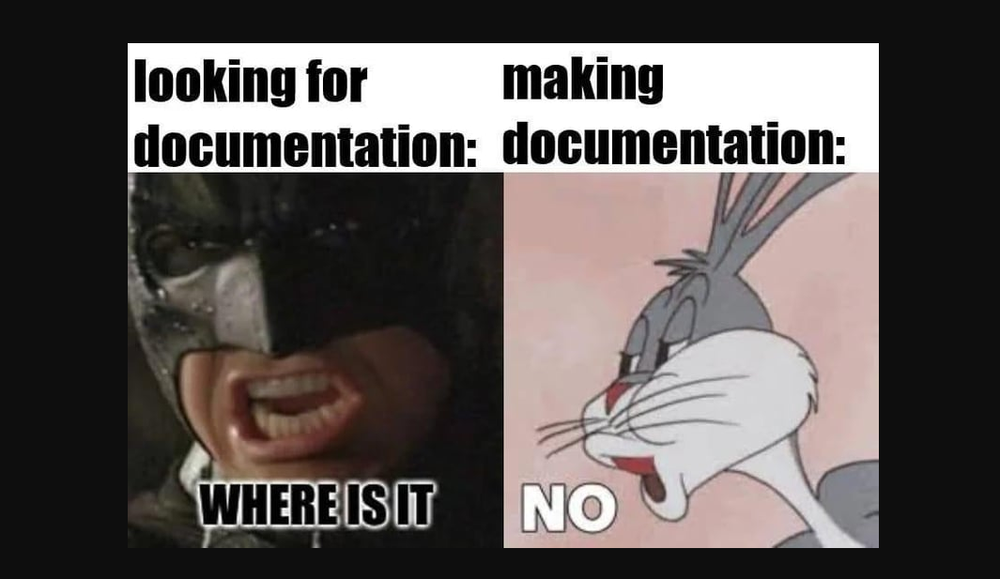

<!-- markdownlint-disable MD033 -->
<!-- markdownlint-disable MD041 -->
<!-- markdownlint-disable MD012 -->
<!-- markdownlint-disable MD036 -->

<div id="top-of-doc"></div>

# Readme File | 10-Progress-Oct-2024 | October-07-2024 |

[My Github](https://github.com/popados) | [Jump to End](#end-of-doc)

---

## Specifications

---

### Day 01 | 10/7/2024 - Monday

Today is a new Monday. Let's get it. What do I need to do? Let's try and find something fun. Work on my projects and join calls.

Notes for `Mastery & Obesssion` call:

- What a thing its like `ADDICTION????`

---

### Day 02 | 10/8/2024 - Tuesday

Tuesday is the day. Log something something. Let's get started at midnight today.

What do I want to design or code?

Worked on the mobile form page. There are a few issues with the header.

Who are the best people to talk to for my projects?

Some of my best work is on the bash script?

Create documentation for the script. Continue to update the HTML/CSS/JAVASCRIPT for each type of page I want to make.

Create more time? Trello board hourly schedule can have lists with the 24 hours of a day. Make cards that have timeslots and activities and put them in place everyday.

Get through the DevSlopes Advanced HTML course. Work on 2 or 3 sections a day while coding other stuff the rest of the day.

- **Trello Activity Cards:**

  - Music
  - Code
  - Design
  - Clean
  - Cats
  - Parents
  - Archery
  - Sleep(?)

- **Learning how to use VIM:**

  - Write shortcuts
  - Look at config files
  - Edit Mode
  - Normal Mode

- **TODO LIST:**

  - Clean
    - Dust [x]
    - Vacuum
    - Dishes [x]
    - Laundry [x]
  - Code [x]
  - Design
  - Arduino
    - Solder
    - LCD Screens
    - Simon Says
  - Music
    - Guitar
    - Drums(?)

---

### Day 03 | 10/9/2024 - Wednesday

Today I woke up later than usual but played games all morning. This was a net result of 1-2 so far? Ended 2-2 I believe and one leaver game. I want to get some more stuff done today. I did laundry yesterday. Time to clean the living room and then get some of my stuff reorganized.

Made time to clean and pulled my stuff from under the table. Now I need to clean the bookshelf and move them around.

Took a walk today. Three times around the block. I saw a cat, bluejay and butterfly while walking lol. What a time to be alive.

- **TODO**
  - Clean [x]
  - Code
  - Design/Draw
  - Quit smoking
  - Create a hourly tracker for my habits
  - Call Attoney Hunsucker [x]
  - Go to verizon for new phone
  -

Going to dinner with my Dad maybe. Got Gyro 360 for dinner. It was good. Watched Robinhood the new Netflix movie. Also

Looking to get more coding and writing done. Let's leave up the markdown file. Get used to VIM and then go from there. Learning the shortcuts and the different ways of copying and pasting is interesting. I don't know what registers are yet.

Played some games. Interesting. Lost alot. Like alot alot. Laggy. Spells not going. ODD-MONEY.

---

### Day 04 | 10/10/2024 - Thursday

> Today being Thursday is Arthur Dent's day. He never figured them out. He heard Jesus died on a Thursday. It was an unpleasant day for alot of people.
> Then the Internet was born. Bad move. Not as bad as some other stuff that has happened. However, generally not a good move. It made things smaller. Good riddance to slow correspondence.

What I want to do today is clean up some of the bookshelf. Move the table to the bookshelf then move the PC to the wall next to the window. The PC will still be on top of the bookshelf. This will prevent smoke and ashe from entering the chasis.

- **TODO**
  - Clean
    - Put clothes away
    - Treadmill
    - Move ottoman
  - Code
  - Design
  - _NEW_ Games
  - Music
  - LEARN VIM!!!

I dont know what to program or code. Most of the work I want to do is fairly advanced and requires alot of reading and studying to make happen.

- **Coding Topics**
  - Website
    - Security and protection
    - Landing pages
  - Machine Learning/AI
  - Embedded Systems
  - Calculate stuff
  - Create UI/Dashboards
  -

Applied to three jobs today. I will see if I get a reply. I should start posting daily on LinkedIn?? Polish portfolio. Finish certain coding projects.

Where do I start with the Pokedex? Should I start over with new html/css?

- **Coding Projects**
  - PokeDex
  - Portfolio
  - Card Game
  - League Site

Writing my Medium article was fun. Everyone seems to hate it. What luck.

Write more articles about whatever?

---

### Day 05 | 10/11/2024 - Friday

I didn't do much today. No writing. Just worked on my Medium article and some web stuff.

What else is going on? OH RIGHT THIS IS WAR??????? OR LOVE **AND** PEACE? Maybe I'll find out one day.

Made nothing but got some cleaning done.

Need to do more game design.

Want to make an HTML cheatsheet.

---

### Day 06 | 10/12/2024 - Saturday

slept and gamed and did some webstuffs

### Day 07 | 10/13/2024 - Sunday

- **Monday TODO List**

  - Add to websites and markdown [x]
  - Probation Meeting [x]
  - HTML Cheatsheet
  - DevSlopes Ciriculum [x]
  - Clean
    - BATHROOMS
      - swept[x]
    - Sheets
  - W-9 [x]
  - Learn Kernel-Level Programming?
  - Learn more design
  - Upwork
  - VS Code Extensions

- **What do I need to do for work.**
  - Loom Videos
  - Write Proposals
  - Present myself?

I need to do some housework. Mop. Dishes. Sheets. Bathrooms. Laundry. Organize. Tables.

### Day 08 | 10/14/2024 - Monday

Today is my probation appointment. Let's see what happens. Should be fine. Just in case I called my lawyer already.

Everything went fine at the PO appointment. It was good. I need to start focusing on work and community service. I need 80 hours to start paying down.

- **Programming and Code**

  - DevSlopes Work
  - Card Game
  - Writing articles
  - Bash Script
  - Game Dev
  - Learn Vim
  -

I need to do some housework. Mop. Dishes. Sheets. Bathrooms. Laundry. Organize. Tables.

- **What do I need to do for work.**
  - Loom Videos
  - Write Proposals
  - Present myself?

### Day 09 | 10/15/2024 - Tuesday

Today is going to become a productive day.

I mean to quit smoking and everything this morning. Morning routine and not smoking is alot harder than I originally thought. ALLLLLLL OF IT NOT HAPPENING AT THE MOMENT. I AM NOT STOPPING THAT _EASILY_.

- **TODO**
  - Clean
    - Dishes [x]
    - Laundry
    - Bathrooms
    - Vacuum
  - Code
    - DevSlopes
    - Card Game
    - Arduino
    - PokeDex
  - Learning
    - Code
    - Cyber Security notes
    - Read LinkedIn School
    - Medium Articles

What is today? Today is the day I code more than game. It is Tuesaday. I should stop smoking and drink water.

**Who, what, where, when, how, why?**

Ask myself these questions everyday. I should get better at doing more productive work.

Network better. Apply for UpWork. Use Loom to record videos.

Very tired. After about 3 or 4 I slept until 3 or 4 the next morning.

---

### Day 10 | 010 10/16/2024 - Wednesday

---

### Day 011 10/17/2024 - Thursday

---

### Day 012 10/18/2024 - Thursday

What to do today. Smack em down in Lergue

---

### Day 013 | 10/20/2024 - Sunday

- **Todo List**
  - Clean
    - Vacuum [x]
    - Laundry
    - Dust [x]
    - Move Shit
  - Cats
    - Treats [x]
    - Litter [x]
    - Playtime [x]
  - Art
  - Code [x]
  - League [x]
  - TV

I want to get to bronze today. Then I need to clean up. Go to archery. Start some new projects. Finish soldering my LCDs.

Need to learn more VIM shortcuts.

### Day 014 | 10/21/2025 - Monday

Sent the pokemon card.

Work on code. Go to mentor classes.

Take notes for Nathans YouTube Class/Talk.

GTO Dr. Islam today for my meds.

---

### Day 015 | 10/23/2024 - Wednesday

WHAT IS HAPPENING? Let's try streaming again? For making shit. 30 days for a game design project. Everyday go 4 to 8 hours on a game project.

Unreal vs Unity is the main question. Unreal is better at building environments and generating quick animations and rigs. Unity is more solo developer-friendly(?)

- Game Design Choices

  - Engine
  - Story
  - Style
  - Mechanics
  - Setting
  - Controls
  - Genre

- Game Engine

  - Unity
  - Unreal
  - Godot
  - Gamemaker
  - JS Canvas
  - Other JS Libraries

- Genre

  - Shooter
  - Builder
  - Objective
  - Action
  - Mechanical
  - Mindless
  -

- Controls

Today I want to learn more VIM and some other things. What else do I want to try and figure out?

Nathan Sevedge's Mastery and Obession talk.

no code vs coding solutions

business operations

long term vs short term goals

- **TODO**

  - Litter
  - Clean
  - Play with cats
  - Make game design
  - Video
  - HTML Cheatsheet
  - Find infograph software
    - Inkscape
    - GIMP
    - PHOTOSHOP? EW
    -
  - Watch Mastery & Obsession - Nathan Sevedge

- specific types of coding knowledge

  - html
  - css
  - js
  - bash
  - variables
  - parameters
  - flexbox/grids/css-layouts

Draft with content. Points of what interest.

Have a hook. Why I have my opinion.

### Day 16 | 10/24/2024 - Thursday

Hackathon - Text based adventure game. Make the terminal game and you are allowed ascii art.

- Submission
  - Code
  - Github
  - Loom Video in 3 minutes
- Criteria
- Idea for a central room with connected areas that have samples of different kind of puzzles/mechanics.

  - Replayability
  - Creativity
  - Game Mechanics

    - Story
    - Turn
    - Puzzle []
      - Scene
        - Dungeon Crawler
      - Items - Don't need
        - Looter
      - Key Phrases
    - Shooter
    - Looter
    - Dungeon Crawler
    - Tactics
      - Chess
      - Fire Emblem

  - Story
  - Design
  - Code Quality
  - Documentation
  - Clean Code
  - Is it a game?
  - Additional features
  - Train AI to narrate
  - Use AI to create JSON for monsters?
  - Depending

- Narration with inside and outside voices

---

### Day 17 | 10/25/2024 - Friday

What else is there to do today. Day 3 of Writing. I want to clean. I am like full azmonslife.

USE MORE GOOGLE LOL

action items

- scroll and engage with linkedin content
- five people who have worked
- Look at tech adjecent roles

- sales
- QA
- product
- data analyst
- tech support

---

### Day 19 | 10/26/2024 - Saturday

today im gonig to do what?

- code
- clean
- sell cards
- play music?
- watch tv
- write

---

### Day 20 | 10/28/2024 - Monday

Well today is a day. What to do?

Still don't know what to do.

Working on stuff and I need to clean.

Post on LinkedIn everyday? Find a service or icebreaker everyday to post.

Today post a meme? -> If you are looking for documentation have fun.



Today I want to apply for some jobs. Get some coding done. Make other stuff.

One step at a time.

---

### Day 21 | 10/29/2024 - Tuesday

Today has been long. I'm tired all the time. Getting through depression is a pain. I'm making myself get through some work. It's alot tougher than I thought because of my head wounds. More than likely I will attempt some rebound and find out how to do stuff infront of people.

I generally type how I speak. Uncouth and less than standard. Many of my words used are explicitly simple in order to reach more audience members.

Work on Loom videos...... GET TO WORK ME. Ask questions? What do I want my audience to learn? Who is the audience? When am I going to get to the primary objective.

[Text-Adv Video](https://www.loom.com/share/8569ec5e1aad4751bbda9035fb58e593)

- Todo
  - Loom video today [x]
  - LinkedIn Post today [x]

Networking, On going learning, tell your story, job applications

---

### Day 22 | 10/30/2024 - Wednesday

### Day 23 | 11/01/2024 - Friday

Still trying to learn vim and code at the same time. It is not easy.

- Connect with CJ, SJ, Luis, Roman, Jonathan Ruiz

Working on the final of the hackathon.

I need to add puzzles and an encounter

The rooms are basically all done.

- North - item
- South - Trap
- West - Lab
- East - Torture Chamber

2 for loops!!

---

### Day 24 | 11/02/2024 - Saturday

Making games and coding showing SJ stuff.

Build a new program?
Work on DevSlopes material
Continue posting

What you finished on Saturday/Sunday/Monday for the Hackathon

- Random encounter [x]
  - Add monster object
  - parse data through and create attack functions
  - Randomize the boss encounter
- ASCII Art [x]
- Puzzle and Solutions [x]
- Cases for switch statement [x]
- Questions for puzzles [x]
- Usable item
- Not having all the puzzle pieces [x]
- Bag of Words array(nouns, verbs, adjectives)
  - implementing this involves detailed puzzles
  - Gives you answers to the puzzle
- Capture mechanic?
- Score mechanic [x]

  - multiple arrays
    - every case is an item
    - make points
    - make traps
  - capture essence of monster
  - each monster you fight gives points
  - each room gives points
  - collect sets of items

- **Friday Nov. 8th Goal**
  - Specific
    - Get to Javascript
  - Measurable
    - One or two videos/day
  - Achievable
    - I know the work
  - Relevant
    - Related to the course
  - Timely
    - Can be achieved in a week

Friday I will finish the html portion of the material by watching a video or two a day.


---

## End of Document

---

[Jump to Top](#top-of-doc)

<div id="end-of-doc"></div>

```

const readline = require('readline');

// Setup readline interface
const rl = readline.createInterface({
  input: process.stdin,
  output: process.stdout
});

// Options to choose from
const options = ['Start Game', 'Settings', 'Exit'];
let selectedIndex = 0;

// Function to display options with an arrow selector
function displayOptions() {
  console.clear();
  options.forEach((option, index) => {
    if (index === selectedIndex) {
      console.log(> ${option});
    } else {
      console.log(  ${option});
    }
  });
  console.log('\nUse the arrow keys to navigate and press Enter to select.');
}

// Capture keypress events for arrow key navigation
process.stdin.on('keypress', (str, key) => {
  if (key.name === 'up') {
    selectedIndex = (selectedIndex > 0) ? selectedIndex - 1 : options.length - 1;
  } else if (key.name === 'down') {
    selectedIndex = (selectedIndex < options.length - 1) ? selectedIndex + 1 : 0;
  } else if (key.name === 'return') {
    console.log(\nYou selected: ${options[selectedIndex]});
    rl.close();
    return;
  }
  displayOptions();
});

// Initialize the display
displayOptions();

```

<details>
  <summary>
    Notes :
  </summary>
</details>
