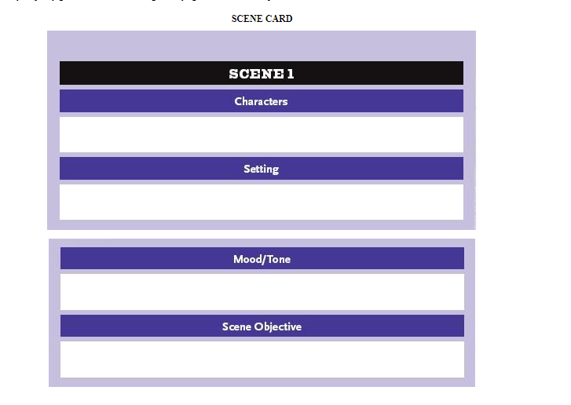
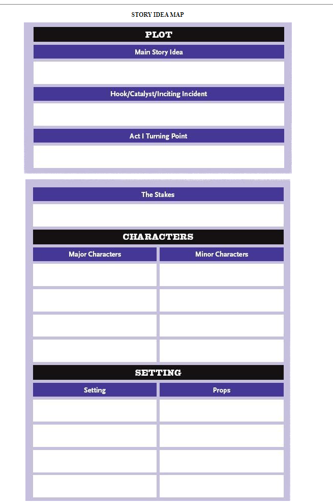

<!-- markdownlint-disable MD033 -->
<!-- markdownlint-disable MD041 -->

# Readme File | writing-doc | October-25-2024 |

[My Github](https://github.com/popados) | [Jump to End](#end-of-doc)

---

## Specifications

---

### Day 001 | 10/23/2024 - Wednesday

Got the story-in-a-sentence.

`An encounter during a pivotal moment the truth behind the Progress Day invasion is revealed, and the world stage turns.`

`At the pivotal moment, a revelation to a truth about the Progress Day invasion decisively transforms the global stage.`

`An encounter during a pivotal moment the truth behind the Progress Day invasion is revealed and decisively transforms the global stage.`

- Day One Notes:
  - Write one-sentence story summary.
    - Strong and specific. [x]
    - Outlines idea and feature in one sentence. [x]
      - Day of Progress
      - Commanders going to war
      - Ghouls and Zombies
      - Stealing stuff
      - Hacking things
      - Finding the "killer" [whodunnit]
      -
  - Map out central story idea

### Day 002 | 10/24/2024 - Thursday

### Day 003 | 10/25/2024 - Friday

Third day working on this story. Need to do the scene cards for day 2. Want to get everything done in the 30 days.

---

### Scene Cards

- **Scene 1:**
  - Characters:
    - Assassins
    - Syndacite Members
    - Heads of State
    -
  - Setting:
    - War Room for the Syndicate
  - Mood/Tone:
    - Tense
    - Sense of accomplishment
  - Scene Objective:
- **Scene 2:**
  - Characters:
    - Heads of State
    - Lieutenants
    - Operators
    - "Guests"
  - Setting:
    - Country War Room(s)
  - Mood/Tone:
    - Tensed then calm
    - Accomplished
    - Worried
    - Calmer
  - Scene Objective:
- **Scene 3:**
  - Characters:
  - Setting:
    - Factory where kid works
  - Mood/Tone:
  - Scene Objective:
- **Scene 4:**
  - Characters:
  - Setting:
    - House of main family
  - Mood/Tone:
  - Scene Objective:
- **Scene 5:**
  - Characters:
  - Setting:
    - the local "hub"
  - Mood/Tone:
- **Scene 6:**
  - Characters:
    - Soliders
    - Medics
    - Spies
    - Generals
    -
  - Setting:
    - Warfront
  - Mood/Tone:
  - Scene Objective:
- **Scene 7:**
  - Characters:
    - Sailors
    - Merchants
    - Guards
    - Street People
  - Setting:
    - Shipping Exports
  - Mood/Tone:
  - Scene Objective:
- **Scene 7:**
  - Characters:
    - Citizens
    - Animals
    - Multi-National
  - Setting:
    - Capital Cities
  - Mood/Tone:
    - Corporate
  - Scene Objective:

---

### Day 004 | 10/26/2024 - Saturday

---

### Day 005 | 10/27/2024 - Monday

---

### Playergedden -

Got the story-in-a-sentence.

`An encounter during a pivotal moment the truth behind the Progress Day invasion is revealed, and the world stage turns.`

`At the pivotal moment, a revelation to a truth about the Progress Day invasion decisively transforms the global stage.`

`An encounter during a pivotal moment the truth behind the Progress Day invasion is revealed and decisively transforms the global stage.`

- Story Idea Template
  - Main Story Idea
  - Hook/Catalyst/Inciting Incident
  - Act I Turning Point
  - The Stakes
  - Characters :
    - Major
    - Minor
  - Settings :
    - Place
    - Props

<!-- Day of progress encounters a gruesome end. When the Commanders learn the truth behind the invasion, the world stage turns. -->

- **Main Story Outline:**
  

  - Create story idea map.

  - **Main Story Idea :**
    - Progress Day is like it is in League. OR IT IS PILTOVER DAY OF PROGRESS. Something something Zaun. Victor. Watch season 2 probably.
    - The world leaders convene to discuss new threats. A hack is exposed. There is violence in multiple capital cities.
    - Each Country is organized by a Syndacite that oversees the production of "Earth" commodities. These commodities are shipped all over the galaxy.
    - Are people commodities?
    - Spice trade
    - Credits
    - Sci-Fi
    - More sci-fi?
    - Fantasy? NOT THIS
    - Isekai-ish OR THIS MAYBE?
  - **Hook/Catalyst/Inciting Incident :**
    - Creation of the overlords
    - Zombies?
    - AI takes over
    - World is starved for resources
    - Exports meet demand and surplus
    - Too many people
    - Too little people
    - Mechs running around
    - Post-Apoc crime is rampant
    - Leaders meet in secret to pledge fealty to the Syndicate
  - **Act I Turning Point :**
    - World turns as the leaders change their positions to help those behind the scenes to seize more control of resources and production.
    - LeLouch reveals the nature of his ability to the class. Everyone is shocked. Two are unshaken. The ability in question gives LeLouch the power to understand what motivates peoples.
    - Ninja Assassin shows up with the heads of states to help rearrange the boundries of the world.
    - All leaders shocked and appalled
    - Don't know this is the path chosen for them
    - Each "head" of state was once a leader for the nation(??)
      - New leaders choose or die
      - The new country borders are drawn up with the strengths of the new politician in mind.
      - Rest of the world is too scarce and overpopulated to care
      - Could be the same mayor from 300 years ago.
        - They don't know who is in charge
        - Just work and work ZUG ZUG
  - **The Stakes :**
    - The World
    - Major country lines
    - Economic infrastructure
    - People's wealth and upward mobility
    - What is worth?
  - **Characters :**

    - Major
    - Protag?
    - Rival?
    - Make a family
    - Minor
    - Shopowners
    - old man crack
    - old lady hat
    - the people

  - **Settings :**
    - Place
    - Make a community
      - Shops
    - Props
    - Weapons
    - Items
      - trinkets
      - consumables

---

- Types of stories
  - Sci-fi
  - Fantasy
  - Romance
  - Mystery
  - Comedy
  - Drama
  - Horror

---

## End of Document

---

[Jump to Top](#top-of-doc)

Notes :

